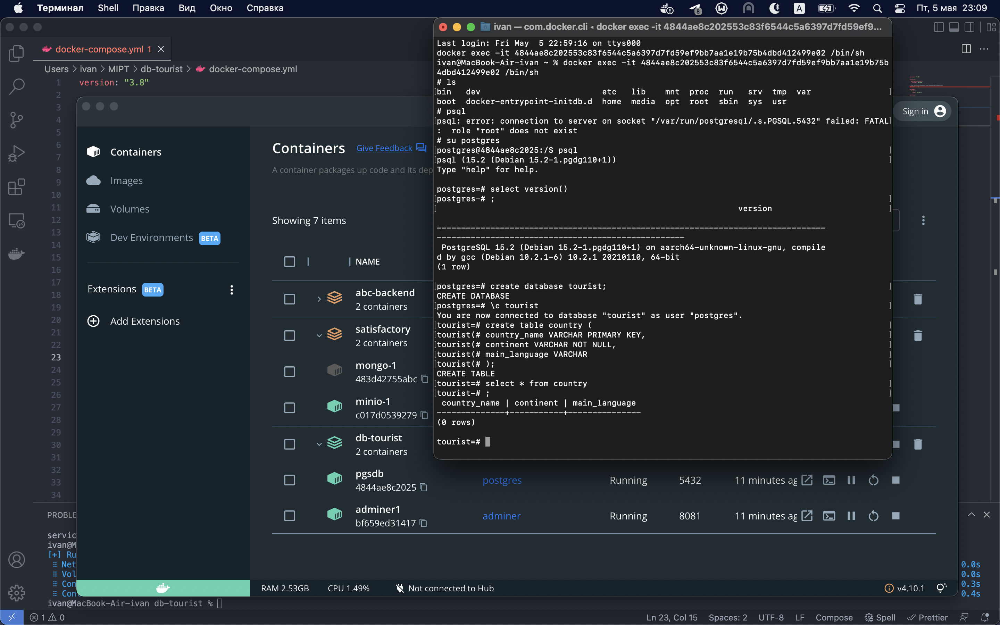
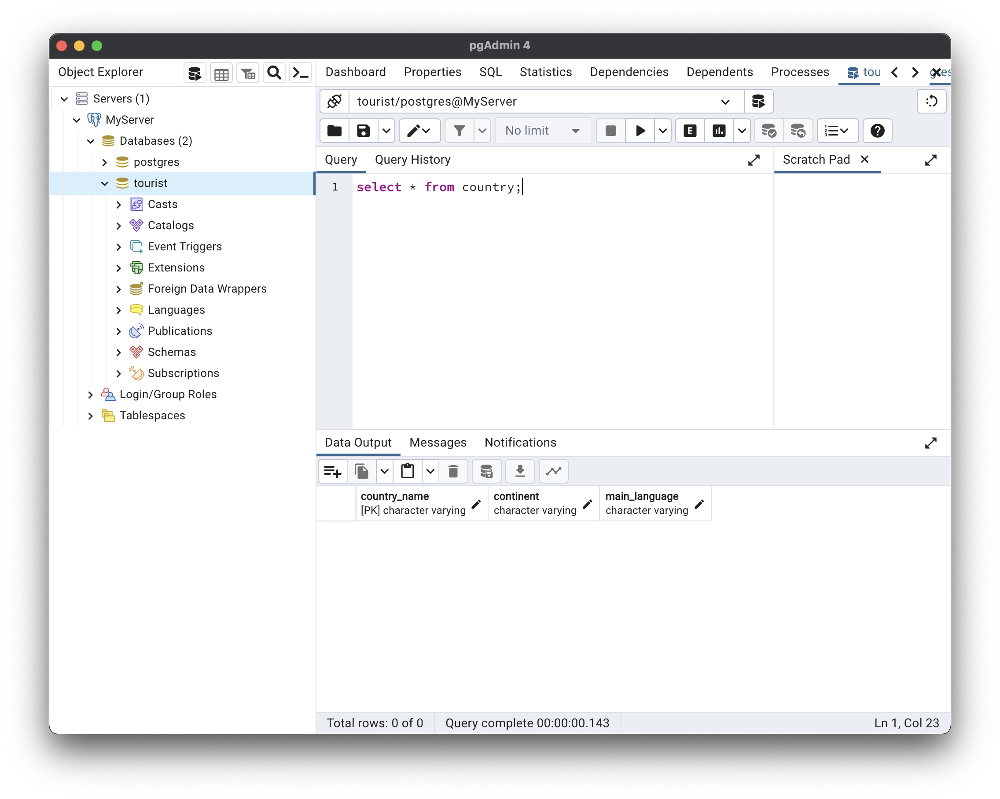
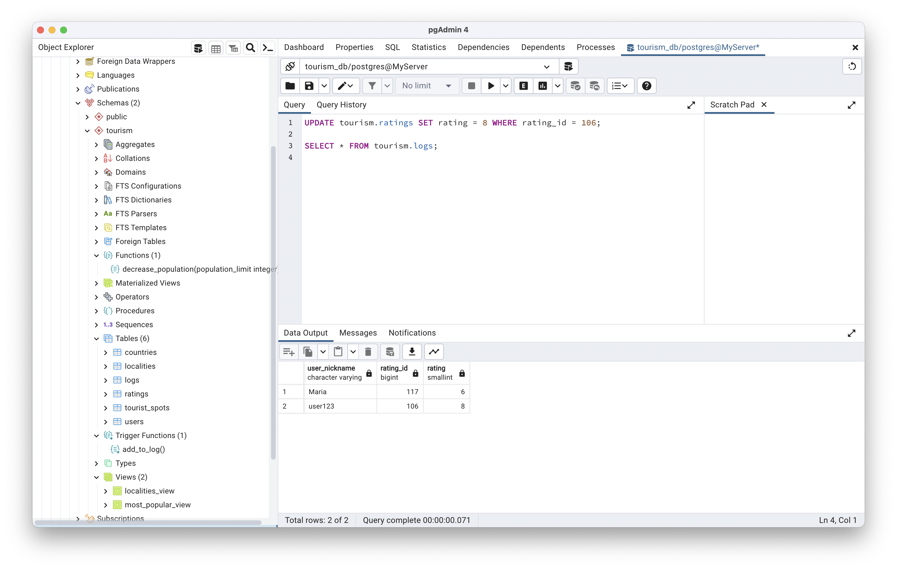

# mipt-db Кудрявцев Иван
База данных для аналога Tripadvisor, в которой хранится информация по достопримечательностям, пользователям и их оценкам достопримечательностей.
## ДЗ 1-2 (уже сдавал)
[Ссылка](https://www.lucidchart.com/invitations/accept/6afbd2f7-b364-4742-921f-58cfbd1f0be4) на модели данных (поправил схемы после замечаний).

## ДЗ 3
Запускал по аналогии с тем, как это было на занятии. Установил `postgres` и `pgAdmin` через утилиту `Homebrew`.
Используя [docker-compose.yml](./docker-compose.yml), внутри корня проекта:
``` bash
docker-compose up -d
```


Внутри `pgAdmin` также подключился, открыл созданную ранее базу данных

## ДЗ 4
Внутри [ddl.sql](./queries/ddl.sql) создается база данных, табличное пространство, схема и таблицы.
## ДЗ 5
Для заполнения таблиц необходимо использовать [inserts.sql](./queries/inserts.sql).
Внутри [select.sql](./queries/select.sql) и [views_and_funcs.sql](./queries/views_and_funcs.sql) запросы, которые остались с прошлого курса по БД, который проходил в бакалавриате.

На `db-fiddle`  у меня не получилось запустить запросы, связанные с триггером(хотя в целом из занятия понял, что их не используют обычно), поэтому прилагаю скриншот из `pgAdmin`.

